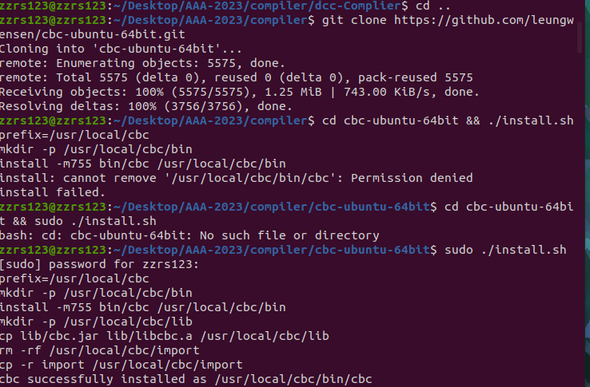
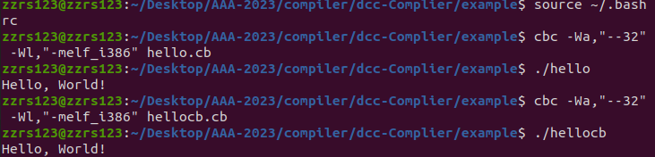

# 自制编译器Day1

## 1. 安装cbc编译器

原本按照书上安装，书上的cbc编译器过于陈旧，无法在64位机器上编译代码。有调整方案，调整的是汇编器，所以调整后可以编译32位，但是无法再编译其他64位程序。所以需要下载支持64位机的cbc编译器：

Github地址如下：https://github.com/leungwensen/cbc-ubuntu-64bit

安装依赖

```bash
apt-get update && apt-get install -y \
        gcc-multilib g++-multilib libc6-i386 lib32ncurses5 lib32stdc++6 \
        openjdk-8-jre \
        git
```

```bash
git clone https://github.com/leungwensen/cbc-ubuntu-64bit.git
cd cbc-ubuntu-64bit && ./install.sh
```



编译器cbc默认安装在 `/usr/local/cbc/bin`

- 打开 `~/.bashrc`
- 在文件末尾追加 `export PATH=$PATH:/usr/local/cbc/bin` 保存退出
- 运行 `source ~/.bashrc`

参考资料：https://blog.csdn.net/qq_43566431/article/details/129582802

```c
import stdio;
 
int
main(int argc, char **argv)
{
printf("Hello Cb Compiler!\n");
return 0;
}
```


```
cbc -Wa,"--32" -Wl,"-melf_i386" test/hello.cb
```


```
./hello
> Hello, World!
```




## 2. 

阅读有一定数量的代码时，首先要做的就是把握代码目录以及文件的构成。这一节将对本书制作的 C♭ 编译器 cbc 的代码构成进行说明。

asm 汇编对象的类
ast 抽象语法树的类
compiler Compiler 类等编译器的核心类
entity 表示函数和变量等实体的类
exception 异常的类
ir 中间代码的类
parser 解析器类
sysdep 包含依赖于 OS 的代码的类（汇编器和链接器）
sysdep.x86 包含依赖于 OS 和 CPU 的代码的类（代码生成器）
type 表示 C♭的类型的类
utils 小的工具类

能有些读者对 List<SourceFile> 这样的表达式还比较陌生，所以这里解释一下。
List<SourceFile> 表 示“ 成 员 的 类 型 为 SourceFile 的 列 表 ”， 简 单 地 说 就 是
“SourceFile 对象的列表”。到 J2SE 1.4 为止，还不可以指定 List、Set 等集合中元素对象
的类型。从 Java 5 开始，才可以通过集合类名 < 成员类名 > 来指定元素成员的类型。
通过采用这种写法，Java 编译器就知道元素的类型，在取出元素对象时就不需要进行类型
转换了。
这种能够对任意类型进行共通处理的功能称为泛型。在 Java5 新增的功能中，泛型使用起
来尤其方便，是不可缺少的一项功能。
